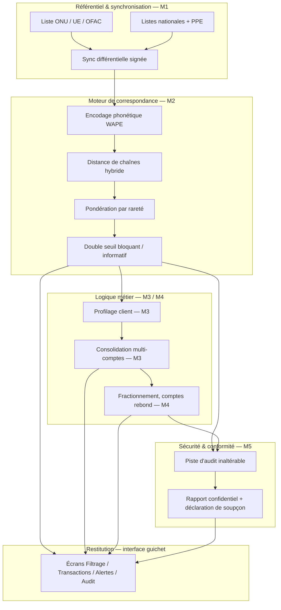

# Architecture — SentinelleCoop

Ce document relie la vision produit (`PRODUCT.md`), le plan de démo (`docs/PRD.md`,
`docs/SPECS.md`, `docs/PLAN.md`) et la note de présentation
(`soumission/02-NOTE-PRESENTATION-SOLUTION.md`, modules M1 à M5) à l'état réel du code, pour
que les 4 membres puissent travailler en parallèle, chacun dans son worktree, sans se marcher
sur les pieds.

Il ne remplace aucun document existant : `PRD.md` reste la cible du pitch, `PLAN.md` reste le
séquencement, `SPECS.md` reste le détail de la démo web. Ce fichier ajoute la vue système et la
répartition par branche qui manquaient.

---

## 1. Vue d'ensemble

Cinq modules (M1-M5), définis dans la note de présentation, organisés en couches. Le réseau
n'intervient qu'en couche basse (synchronisation), jamais dans le chemin d'une décision au
guichet — c'est le principe hors-ligne d'abord.

## 2. Deux implémentations, un seul contrat

Le dépôt contient volontairement deux exécutables séparés, avec un rôle différent (choix déjà
posé par `PRODUCT.md` / `SPECS.md`) :

| | `sentinellecoop/` (Python) | `demo/` (web statique) |
|---|---|---|
| Rôle | Moteur de référence, preuve chiffrée (benchmark) | Support de pitch, 4 écrans, données synthétiques |
| Exécution | `python -m sentinellecoop.screen "<nom>"` | `python -m http.server 8787 -d demo` |
| Données | Liste ONU réelle (`data/un_consolidated.xml`) | Clients/comptes simulés en dur dans `app.js` |
| Statut | M1 (partiel) + M2 (fait, mesuré) | M2 (réimplémenté en JS, simplifié) + M3/M4/M5 (simulés) |

**Point d'architecture à trancher en équipe, pas à décider seul :** aujourd'hui `demo/app.js`
réimplémente une version simplifiée du matching en JavaScript plutôt que d'appeler le moteur
Python. C'est délibéré pour le pitch (`PRODUCT.md` : « démo… dépendency-free »). Si le temps le
permet, une évolution possible est de faire écrire par `sentinellecoop/screen.py` un export JSON
(`data/resultats_demo.json`) que `app.js` charge, pour que la démo montre le vrai moteur. Ce
n'est pas bloquant pour livrer — à décider en J2/J3 selon l'avancement.

## 3. État par module (au 5 septembre 2026)

| Module | Fichier(s) | Statut | Manque |
|---|---|---|---|
| M1 — Référentiel & sync | `sentinellecoop/ingest.py` | Partiel : charge un instantané ONU complet | Correctif différentiel signé, listes nationales, indicateur de fraîcheur en continu, PPE |
| M2 — Moteur phonétique | `sentinellecoop/phonetics.py`, `matcher.py` | Fait, mesuré (`benchmark.py` : 94,9 % / 99,0 %) | Calibrage sur données réelles d'une coopérative (hors portée démo) |
| M3 — Profilage & consolidation | absent en Python ; simulé dans `demo/app.js` (`analyzeClient`) | Manquant côté moteur | Modèle de données client/compte/transaction en Python, solde global consolidé, cumul glissant 7 jours |
| M4 — Comportemental | absent en Python ; alerte "compte rebond" simulée dans `demo/app.js` | Manquant côté moteur | Détection de fractionnement et de comptes rebond sur données réelles/simulées structurées |
| M5 — Audit & actes | `demo/app.js` (`renderAudit`, `buildReport`) : journal en mémoire, export texte | Démo uniquement, non persistant, non inaltérable | Piste d'audit horodatée persistée, hash-chaînée ou signée ; génération des actes (art. 21, art. 60) |
| UI / restitution | `demo/index.html`, `styles.css`, 4 écrans | Fait selon `SPECS.md` | Revue ergonomie guichet, accessibilité poste modeste, paquet de déploiement local |

## 4. Contrats de données partagés

Pour que les 4 branches avancent en parallèle sans collision de fichiers ni divergence de
schéma, toute nouvelle donnée structurée passe par `data/` avec ces formes minimales (à ajuster
en équipe, mais à ne pas faire diverger silencieusement) :

- **Personne référentiel** — déjà fixé par `ingest.Personne` : `identifiant, nom, alias, liste,
  reference, nationalite, naissance, inscrit_le, type_entree`.
- **Client** (nouveau, pour M3) : `id, nom, type (habituel|occasionnel), agence, ppe (bool),
  date_ouverture`.
- **Compte** (nouveau, pour M3) : `id, client_id, solde, agence`.
- **Transaction** (nouveau, pour M3/M4) : `id, compte_id, montant, sens (entree|sortie),
  date_heure, compte_contrepartie_id (optionnel)`.
- **Alerte** (déjà esquissé dans `demo/app.js`) : `id, severite (bloquant|informatif), type,
  client_id, motif, score, statut, decisions[]` où chaque décision porte `action, motif,
  horodatage, auteur`.
- **Entrée d'audit** (pour M5) : `horodatage, acteur, action, cible, motif` — write-only, jamais
  modifiée après écriture.

Celui qui introduit un de ces objets en premier (probablement M3 côté `feature/moteur-ia`, M5
côté `feature/securite-audit`) documente le schéma exact choisi en tête du fichier qui le
définit — un docstring suffit, pas besoin d'un nouveau document séparé.

## 5. Répartition par branche

Correspond aux 4 worktrees déjà créés. Chacun travaille dans `.worktrees/<dossier>/`, sur sa
branche, et pousse régulièrement — voir `GUIDE_GIT.md` pour le flux Git.

### `feature/moteur-ia` — OUEDRAOGO Yannick (chef d'équipe)

Axe : M2 (déjà fait, à garder mesuré) + M3 (à construire) + intégration système d'information.

- Construire le modèle client/compte/transaction en Python (`sentinellecoop/comptes.py` ou
  équivalent), conforme aux contrats de la section 4.
- Solde global consolidé multi-comptes, recensement des opérations par client (art. 13 e, art. 21 a).
- Décider et documenter le point d'intégration avec `demo/app.js` (section 2) si le temps le permet.

### `feature/offline-sync` — KOALA Wendpanga Gédéon

Axe : M1.

- Faire évoluer `ingest.py` d'un chargement complet vers un correctif différentiel (ajouté /
  modifié / radié depuis le dernier état connu).
- Indicateur de fraîcheur persistant (déjà esquissé par `screen.fraicheur()` — le rendre
  continu et journalisé, pas recalculé à la volée).
- Brancher une deuxième source (liste UE ou OFAC) sur le même modèle `Personne` pour prouver
  que l'architecture tient à plusieurs sources.

### `feature/securite-audit` — MAMOUDOU Ayouba

Axe : M5 (sécurité et intégrité) + piste d'audit.

- Remplacer le journal en mémoire de `demo/app.js` (`renderAudit`) par une piste d'audit
  persistée sur disque, horodatée, non modifiable a posteriori (append-only ; hash-chaînage
  simple acceptable pour la démo).
- Générer les actes de conformité (rapport confidentiel art. 21, projet de déclaration art. 60)
  à partir des alertes existantes, en réutilisant le contrat « Alerte » de la section 4.
- Revue de sécurité du système d'information dans son ensemble avant la présentation (pas de
  secret en dur, pas de donnée client réelle dans le dépôt).

### `feature/ux-guichet` — GUEL Fabrice

Axe : restitution et déploiement.

- Revue des 4 écrans (`demo/index.html`, `styles.css`) pour un agent de guichet non
  informaticien : lisibilité, clarté de l'action à prendre sur une alerte, comportement sur
  poste modeste.
- Préparer le paquet de déploiement local (`docs/PLAN.md`, phase 6 : `python -m http.server`)
  et vérifier qu'il tourne sans aucune dépendance à installer, sur une machine « propre ».
- Répétition du pitch de 4 minutes (`docs/PRD.md`, critères de succès) une fois les écrans
  stabilisés.

## 6. Intégration

- Chaque branche pousse régulièrement vers `origin/feature/...` (voir `GUIDE_GIT.md`).
- Le chef d'équipe (`feature/moteur-ia`) fusionne dans `main` via Pull Request, relue par un
  autre membre — jamais auto-validée (règle déjà posée par `GUIDE_GIT.md`, section 6.4).
- Ordre de fusion suggéré, du moins risqué au plus risqué : `feature/offline-sync` et
  `feature/securite-audit` (fichiers propres, peu de recoupement avec la démo) avant
  `feature/moteur-ia` et `feature/ux-guichet` (les deux touchent potentiellement `demo/app.js`).
- En cas de doute sur un schéma de données avant de fusionner, se référer à la section 4 plutôt
  que d'improviser un format concurrent.
